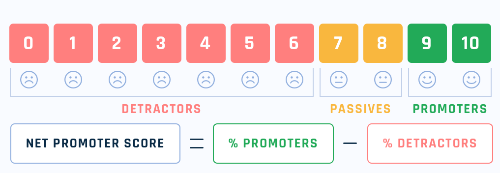

<!-- Hepimiz bir gün pazarlama anketi yapacağız.
Birine bir şey soracağız ve gelen dönüşleri değerlendirip bir sınıflandırma yapacağız. -->

NPS, 2003 yılında Fred Reichheld tarafından tanıtılmış, müşteri sadakatini ölçmek için kullanılan **basit** bir göstergedir. Tek bir soruya dayanır:

> “Bu ürünü/markayı bir arkadaşınıza veya iş arkadaşınıza tavsiye etme olasılığınız nedir?”

Cevaplar **0–10** arasında bir ölçekle alınır.

| Skor Aralığı | Kategori                   | Açıklama                                                   |
| ------------ | -------------------------- | ---------------------------------------------------------- |
| **0-6**      | Detractors / Caydırıcılar  | Caydırıcı, olumsuz görüşleri olan bir kitleyi temsil eder  |
| **7-8**      | Passives / Tarafsızlar     | Tarafsız, Pasif bir kitleyi temsil eder                    |
| **9-10**     | Promoters / Teşvik Edenler | Teşvik eden, olumlu görüşleri olan bir kitleyi temsil eder |

<!-- truncate -->

## Örnek Sorular

Soru: Bizi arkadaşınıza tavsiye eder misiniz?

Cevap: 0-10 arası puanlandırma.

    Kaynak: <a href="https://en.wikipedia.org/wiki/Net_promoter_score#/media/File:NetPromoterScore-NPS.png" target="_blank">Wikipedia</a>

