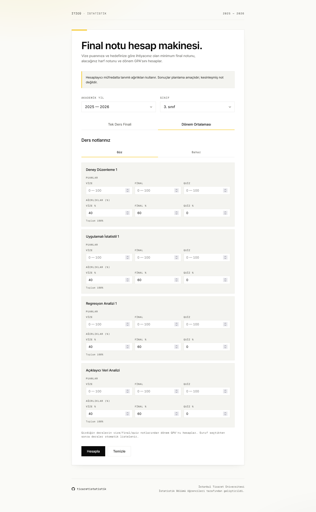

Dönem içinde sürekli aynı soru kafada dolaşır: *"Bu dersten AA almak için finalde kaç almam gerekiyor?"* veya *"Bu dönemin ortalaması ne çıkacak?"* Artık bu hesabı zihinde kovalamaya gerek yok. **Not Hesaplayıcı** yayında:

**[hesapla.ticaretistatistik.com](https://hesapla.ticaretistatistik.com/)**

<!-- truncate -->

## Ne yapıyor?

Araç iki modda çalışıyor:

- **Tek Ders Finali** — Vize puanın ve hedeflediğin harf notu üzerinden finalde alman gereken **minimum puanı** söyler. "Bu dersten BB için en az kaç almalıyım?" sorusunun hızlı cevabı.
- **Dönem Ortalaması** — Seçtiğin sınıftaki dersler otomatik listelenir; vize / final / quiz puanlarını girdikçe dönemin **AGNO**'su anında hesaplanır.

## Neden yaptık?

Çoğu öğrencinin "bu dersi geçmem için ne gerekiyor?" sorusuna verdiği cevap ya eline aldığı bir kağıt ya da Excel'de kurulmuş bir formül oluyor — hem hatalı, hem zahmetli. Aracı tasarlarken üç hedefimiz vardı:

1. **Müfredata uygun olsun.** Her dersin vize / final ağırlıkları müfredatta zaten tanımlı; kullanıcıya baştan girdirmeyelim.
2. **Hızlı olsun.** Sınıf seçtiğinde dersler otomatik gelsin, forma sadece puanları girmek kalsın.
3. **Çevrimiçi çalışsın.** Kayıt yok, kurulum yok — bir sayfa ve birkaç tık.

## Nasıl kullanılır?

1. **Akademik yıl** ve **sınıf** seç. Müfredattaki dersler otomatik listelenir.
2. İstediğin moda geç: *Tek Ders Finali* veya *Dönem Ortalaması*.
3. **Güz** veya **Bahar** sekmesinden ilgili yarıyılı aç.
4. Vize, final (tahmini veya bilinen) ve varsa quiz puanını gir. Ağırlıklar varsayılan olarak müfredatta tanımlı değerleri alır; özel durumlarda alanları elle güncelleyebilirsin (toplam 100%'i koruduğun sürece).
5. **Hesapla**'ya bas. Sonuçlar anında çıkar.

## Öne çıkan özellikler

- **Akademik yıl seçici.** 2025 – 2026 müfredatıyla başlıyoruz; eski dönem müfredatları da desteklenecek.
- **Sınıf bazlı otomatik ders listesi.** 1. sınıftan 4. sınıfa kadar, Güz ve Bahar ayrımı ile.
- **Özel ağırlık desteği.** Öğretim üyesinin ağırlıkları müfredattan farklı tuttuğu durumlar için tüm ağırlık alanları düzenlenebilir.
- **Anlık toplam kontrolü.** Ağırlıklar 100%'ü bulmazsa kart seni uyarır.
- **Kayıt tutulmuyor.** Girdiğin hiçbir puan sunucuya gönderilmiyor — tüm hesaplama tarayıcıda yapılıyor.

## Önemli not

Hesaplayıcı, müfredatta tanımlı **varsayılan** ağırlıklarla çalışır. Bazı derslerde öğretim üyesi farklı bir ağırlık belirlemiş (örneğin ödev yüzdesi ekleyerek) olabilir; bu durumda ağırlık alanlarını kendin güncelleyebilirsin.

> Sonuçlar **planlama amaçlıdır**; transkripte yansıyan kesin not değildir. Resmi not için üniversitenin sistemi üzerinden ilan edilen değerleri esas al.

## Katkıda bulun

Araç açık kaynak. Müfredatta eksik bir ders gördüysen, ağırlık tablosunda bir yanlış varsa ya da eklenmesini istediğin bir özellik varsa GitHub üzerinden issue aç veya PR gönder:

- [github.com/ticaretistatistik/hesapla](https://github.com/ticaretistatistik/hesapla)

Sınavlarda başarılar.
