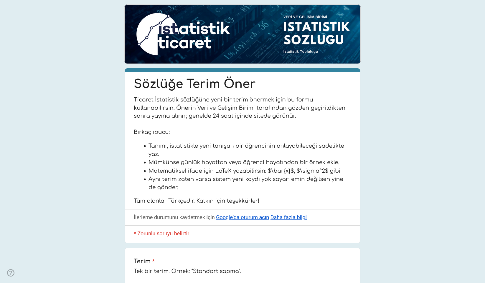

Bugün Ticaret İstatistik sözlüğünü yayına aldık. Aslında **33 terim hazırdı**. Ama biz sadece **3'üyle** açtık.

Çıldırmadık. Yayın gününe saatler kala bir hipotez geldi aklımıza ve önceki bütün hazırlığı bir kenara bırakmaya değecek kadar inandık ona: tek bir kişinin yazdığı sözlük, tanımı gereği eksik bir sözlüktür. Çünkü "biz" iki üç editörden ibaret değiliz. Bu sözlüğü açıp bir terim arayan, anlamadığı bir tanımın altını çizen, "bu örnek yetmez" diye söylenen herkes "biz"iz. **Sen de bizdensin.** Sözlüğü tamamlayacak olan da o yüzden sensin.

<!-- truncate -->

## Sözlük niye var?

Fikir uzun zamandır dolaşıyordu. Çünkü ne yazık ki:

- Üniversite ders notları **"standard deviation"** der, sınav sorusu **"standart sapma"** sorar, ders kitabı **"ölçüt sapma"** kullanır. Aynı kavram, üç ad.
- Haberler **"ortalama gelir"** der, ama o ortalamanın medyana oranla nasıl bir yanılsama yarattığı asla anlatılmaz.
- Bir öğrenci P-değerini Google'lar; karşısına gelen ilk üç sonucun ikisi yanlış, üçüncüsü İngilizce.

Türkçe istatistik öğrenmeye çalışan birine, "bu terim ne demek?" sorusunun cevabını üç tıkta veren bir yer açmak istedik. Aylarca üzerinde çalıştık: 33 terim, hepsi Türkçe karşılığı, tanımı, günlük hayattan bir örneği ve ilgili terimleriyle. Ortalama, medyan, varyans, regresyon, p-değeri, hipotez testi, korelasyon... Yayın için gün belirledik, görselleri hazırladık, paylaşıma hazırdık.

## Yayın gününden önceki son okuma

Çıkarmadan önceki son okumada bir şey rahatsız etti.

**Tek yazarlı bir sözlük, çok yazarlı bir konunun çarpık izdüşümüdür.** Yazdığımız 33 tanımın hepsi aynı kafadan çıkmıştı — aynı örnek tipleri, aynı bakış açısı, aynı seviye varsayımı. Bir mühendislik öğrencisi okuduğunda kafası karışacaktı, çünkü biz iktisat bakışıyla yazmıştık. Bir öğretim görevlisi yetersiz bulacaktı, çünkü biz onun sınıfının seviyesini bilmiyorduk.

Üstelik Türkçe'nin kendine özgü bir sorunu var: aynı kavramın 2-3 farklı tercümesi dolaşımda. Hangisini "doğru" sayacağız? Bu kararı tek başımıza vermek dürüst değildi.

Bir başka şey daha vardı. Sözlüğü 33 terimle yayınlasaydık, ziyaretçinin gözünde "bitmiş" görünecekti. Kimse zaten dolu görünen bir kavanoza taş atmaz. Katkı çağrısı yapsak da çağrı boşa düşecekti.

## Bu yüzden 30'unu geri çektik

Şu an sözlükte yalnızca üç terim var:

- **Ortalama**
- **Regresyon**
- **Standart sapma**

Üçü de örnek/şablon. "İyi bir tanım nasıl yazılır, nasıl bir örnekle desteklenir, nasıl sade kalır" göstermek için duruyorlar. Yazdığımız diğer 30 terimi sileceğiz dedik, sonra vazgeçtik — onları bir kenara çekip sakladık. Belki bir gün senin önerinle birlikte güncellenmiş halleriyle yayına dönerler. Belki tamamen senin yazdığın sürüm onların yerini alır. İkisi de bizim için iyi sonuç.

Geri kalan otuz boşluğu — ve onların ötesindeki yüzlerce terimi — **sana** bıraktık.

## Nasıl katkıda bulunulur

Süreç tek bir Google Forms üzerinden yürüyor — ne GitHub hesabı açman gerek, ne kod yazman, ne de bir editör arayüzüyle boğuşman.

Adımlar şöyle:

1. **Forma git.** [Sözlüğe terim öner](https://forms.gle/s5jreyNxNUiMzDkX7) — 5 dakika sürer.
2. **Bir terim doldur.** Türkçesini, varsa İngilizce karşılığını, 2-4 cümlelik bir tanımı, tercihen günlük hayattan bir örneği yaz. İlgili gördüğün terimleri noktalı virgülle ayır: `Medyan; Ortalama; Aykırı değer`.
3. **Editör inceler.** Anlam doğru mu, dil sade mi, örnek konuyu güçlendiriyor mu — küçük rötuşlar yapılabilir.
4. **En geç 6 saat içinde sözlükte yayınlanır.** Onay aldıktan sonra site otomatik olarak yeniden derleniyor; o döngüye yetişen ilk öneri o gün canlıya çıkar. Adını yazdıysan katkıda bulunanlar arasında anılırsın; yazmazsan anonim kalır.

İşin "perde arkası" şöyle: form yanıtların bir Google Sheets dosyasına düşüyor, editör onayladıktan sonra bir betik o satırı sözlüğün ana tablosuna kopyalıyor, GitHub Actions her 6 saatte bir siteyi yeniden derleyip yayına alıyor. Süreç tamamen şeffaf — kod açık, Sheet public, repo herkese görünür.

## Hangi terimlerle başlayabilirsin?

Aklımıza ilk gelen, "olmaması delilik" listesi:

- **Medyan** — ortalamanın gölgesinden çıkması gereken kavram
- **Aykırı değer** — verinin hikâyesini yazan tek tip değer
- **P-değeri** — yanlış anlaşılmaların kraliçesi
- **Histogram** — dağılımı görsel olarak hissettiren grafik
- **Korelasyon** — "nedensellik değildir" diye dövüne dövüne öğrendiğimiz kavram
- **Bayes teoremi** — taban oranı paradoksunu anlatan teorem
- **Merkezî limit teoremi** — çıkarımsal istatistiğin omurgası
- **Hipotez testi** — "anlamlı" sözcüğünün matematiksel hâli
- **Ki-kare testi** — kategorik veriler için temel sınama
- **Güven aralığı** — anket haberlerindeki "± 3 puan" lafının arkasındaki şey

Bu listeden birini seçebilir, ya da kendi karşılaştığın, "ya bu zaten sözlükte olmalıydı" dediğin bir terimi gönderebilirsin. Senin günlük hayatında bir karşılığı varsa, başka birinin de hayatında karşılığı vardır.

## Son söz

Sözlük "tamamlanmış" bir şey değil; canlı, zamanla derinleşen bir kaynak. Sen bir terim eklediğinde nereye gideceğini bilemezsin. Belki senin gibi düşünen bir lisans öğrencisi gelecek hafta o tanımı okuyup kavramı çözecek. Belki bir araştırmacı dipnotunda referans verecek. Belki bir akademisyen dersinde örnek olarak kullanacak. Belki bir gazeteci haberini yazmadan önce bir kez daha düşünecek. Belki bir lise öğretmeni tahtaya senin yazdığın cümleyi yazacak.

Bu blogun varlık sebebi tam olarak bu. Otuz boşluk değil — istatistiğin Türkçeye sığmaya çalıştığı yüzlerce kavram seni bekliyor.

[**→ Sözlüğe terim öner**](https://forms.gle/s5jreyNxNUiMzDkX7)
